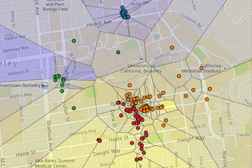

<!-- Improved compatibility of back to top link: See: https://github.com/othneildrew/Best-README-Template/pull/73 -->
<a name="readme-top"></a>


<!-- PROJECT SHIELDS -->
<!--
*** I'm using markdown "reference style" links for readability.
*** Reference links are enclosed in brackets [ ] instead of parentheses ( ).
*** See the bottom of this document for the declaration of the reference variables
*** for contributors-url, forks-url, etc. This is an optional, concise syntax you may use.
*** https://www.markdownguide.org/basic-syntax/#reference-style-links

[![Contributors][contributors-shield]][contributors-url]
[![Forks][forks-shield]][forks-url]
[![Stargazers][stars-shield]][stars-url]
[![Issues][issues-shield]][issues-url]
[![MIT License][license-shield]][license-url]
[![LinkedIn][linkedin-shield]][linkedin-url]
-->


<!-- PROJECT LOGO -->
<br />
<div align="center">

<h3 align="center">Yelp Maps</h3>

  <p align="center">
    A visualisation of both restaurant clustering and restaurant recommendation based on the Yelp academic dataset. 
    <br />
    <a href="https://github.com/simondoebele/maps"><strong>Explore the docs »</strong></a>
    <br />
    <br />
    <a href="https://github.com/simondoebele/maps/issues">Report Bug</a>
    ·
    <a href="https://github.com/simondoebele/maps/issues">Request Feature</a>
  </p>
</div>



The above is a Voronoi diagram (on top of the map of Berkeley). In this visualisation, a dot represents a restaurant, its color depends on the restaurant's location, and the colors of the regions refer to the restaurant preferences of the user.


<!-- TABLE OF CONTENTS -->
<details>
  <summary>Table of Contents</summary>
  <ol>
    <li>
      <a href="#about-the-project">About The Project</a>
    </li>
    <li>
      <a href="#getting-started">Getting Started</a>
      <ul>
        <li><a href="#prerequisites">Prerequisites</a></li>
        <li><a href="#usage">Usage</a></li>
        <li><a href="#structure">Repository Structure</a></li>
      </ul>
    </li>
    <li><a href="#contributing">Contributing</a></li>
    <!-- <li><a href="#acknowledgments">Acknowledgments</a></li> -->
  </ol>
</details>


<!-- ABOUT THE PROJECT -->
## About The Project

This project combines machine learning (supervised and unsupervised learning, i.e. k-means and regression) with data visualisation.  A visualisation in the form of a Voronoi diagram can be produced, which both clusters restaurants. On top of this, a simple recommendation can be produced for a user, as to what score he would give a certain restaurant he has not yet tried. It was a project as part of the course [CS61A](https://inst.eecs.berkeley.edu/~cs61a/fa17/proj/maps/) at the University of California, Berkeley. The overarching purpose of the project was to learn about working with data. I worked mainly on the utility functions, the ML algorithms and the data abstractions part of the project (not on the visualization).


<p align="right">(<a href="#readme-top">back to top</a>)</p>


<!-- GETTING STARTED -->
## Getting Started

### Prerequisites

* Python 3.6


<!-- USAGE EXAMPLES -->
### Usage

You can:

(1) Generate a visualization of all restaurants rated. Use -u to select a specific user from the users directory.

   ```sh
   python3 recommend.py
   ```

      ```sh
  python3 recommend.py -u one_cluster
   ```

(2) Select the number of clusters with the -k option:

      ```sh
  python3 recommend.py -k 2
   ```

         ```sh
  python3 recommend.py -u likes_everything -k 3
   ```

(3) Predict the rating of a user for a restaurant, by adding the -p option:

         ```sh
  python3 recommend.py -u likes_southside -k 5 -p
   ```
The rating appears if you hover over a dot (representing a restaurant) in the visualization.

(4) Filter based on a category (such as Sandwiches) using -q:

         ```sh
  python3 recommend.py -u likes_expensive -k 2 -p -q Sandwiches
   ```

(5) Predict your own ratings, by:
- creating a new .dat file in the users directory (with your name and some reviews of your own)
- In order to see what Restaurants there are for which you can give reviews, type:

         ```sh
  python3 recommend.py -r
   ```

- Then simple predict ratings for yourself with the above commands.


<p align="right">(<a href="#readme-top">back to top</a>)</p>


<!-- Repository Structure -->
### Repository structure

- abstractions.py: Data abstractions
- recommend.py: Machine learning algorithms and data processing
- utils.py: Utility functions for data processing
- ucb.py: Further utility functions
- data: A directory of Yelp users, restaurants, and reviews
- tests: A directory of tests
- users: A directory of user files
- visualize: A directory of tools for drawing the final visualization


<p align="right">(<a href="#readme-top">back to top</a>)</p>


<!-- CONTRIBUTING -->
## Contributing

If you have a suggestion that would make this better, please fork the repo and create a pull request. You can also simply open an issue with the tag "enhancement".
Don't forget to give the project a star! Thanks again!

1. Fork the Project
2. Create your Feature Branch (`git checkout -b feature/AmazingFeature`)
3. Commit your Changes (`git commit -m 'Add some AmazingFeature'`)
4. Push to the Branch (`git push origin feature/AmazingFeature`)
5. Open a Pull Request

<p align="right">(<a href="#readme-top">back to top</a>)</p>


<!-- ACKNOWLEDGMENTS 
## Acknowledgments

* []() https://github.com/othneildrew/Best-README-Template/
* []()
* []()


<p align="right">(<a href="#readme-top">back to top</a>)</p>
-->


<!-- MARKDOWN LINKS & IMAGES -->
<!-- https://www.markdownguide.org/basic-syntax/#reference-style-links -->
[contributors-shield]: https://img.shields.io/github/contributors/github_username/repo_name.svg?style=for-the-badge
[contributors-url]: https://github.com/github_username/repo_name/graphs/contributors
[forks-shield]: https://img.shields.io/github/forks/github_username/repo_name.svg?style=for-the-badge
[forks-url]: https://github.com/github_username/repo_name/network/members
[stars-shield]: https://img.shields.io/github/stars/github_username/repo_name.svg?style=for-the-badge
[stars-url]: https://github.com/github_username/repo_name/stargazers
[issues-shield]: https://img.shields.io/github/issues/github_username/repo_name.svg?style=for-the-badge
[issues-url]: https://github.com/github_username/repo_name/issues
[license-shield]: https://img.shields.io/github/license/github_username/repo_name.svg?style=for-the-badge
[license-url]: https://github.com/github_username/repo_name/blob/master/LICENSE.txt
[linkedin-shield]: https://img.shields.io/badge/-LinkedIn-black.svg?style=for-the-badge&logo=linkedin&colorB=555
[linkedin-url]: https://linkedin.com/in/linkedin_username
[product-screenshot]: images/screenshot.png
[Next.js]: https://img.shields.io/badge/next.js-000000?style=for-the-badge&logo=nextdotjs&logoColor=white
[Next-url]: https://nextjs.org/
[React.js]: https://img.shields.io/badge/React-20232A?style=for-the-badge&logo=react&logoColor=61DAFB
[React-url]: https://reactjs.org/
[Vue.js]: https://img.shields.io/badge/Vue.js-35495E?style=for-the-badge&logo=vuedotjs&logoColor=4FC08D
[Vue-url]: https://vuejs.org/
[Angular.io]: https://img.shields.io/badge/Angular-DD0031?style=for-the-badge&logo=angular&logoColor=white
[Angular-url]: https://angular.io/
[Svelte.dev]: https://img.shields.io/badge/Svelte-4A4A55?style=for-the-badge&logo=svelte&logoColor=FF3E00
[Svelte-url]: https://svelte.dev/
[Laravel.com]: https://img.shields.io/badge/Laravel-FF2D20?style=for-the-badge&logo=laravel&logoColor=white
[Laravel-url]: https://laravel.com
[Bootstrap.com]: https://img.shields.io/badge/Bootstrap-563D7C?style=for-the-badge&logo=bootstrap&logoColor=white
[Bootstrap-url]: https://getbootstrap.com
[JQuery.com]: https://img.shields.io/badge/jQuery-0769AD?style=for-the-badge&logo=jquery&logoColor=white
[JQuery-url]: https://jquery.com 
